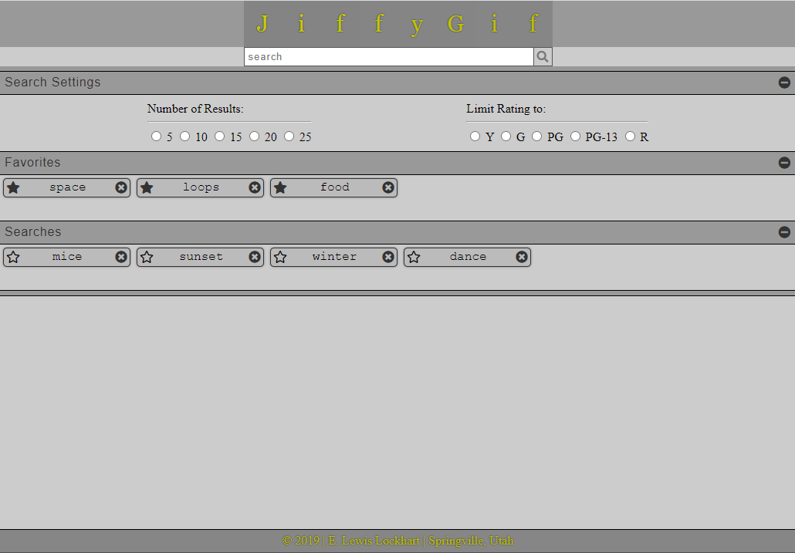
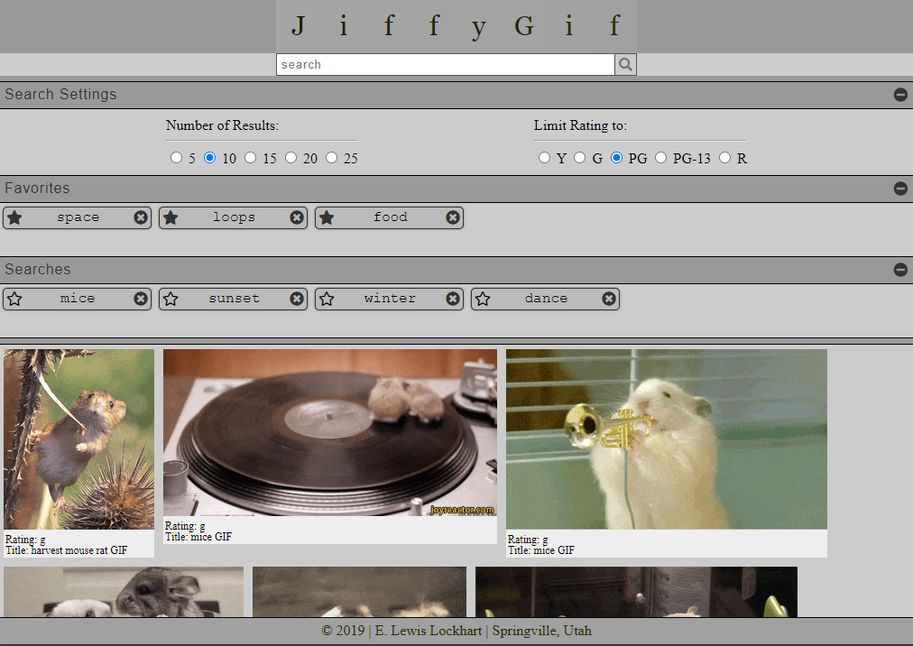

# Giphy_API
A basic gif search API page. Allows users to select number of results, and ratings. Searches are automatically added to the searches section. Searches can be added and removed from the favorites section. Results are returned with the gif name and rating information.

## Deployed Site
https://lewis00001.github.io/Giphy_API/

## Screenshots

